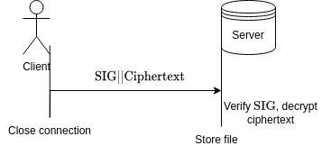
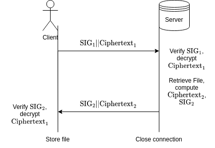

# EE5453 Assignment 6 - File Transfer Service

## Team Composition

* Farin Ahmed
* James Ryan

## Team Tasks

This is a group assignment developed together by Farin Ahmed & James Ryan.

## Program Approach

In order to build the file server from which a file can be requested bidirectional, python socket library was used.
To achieve confidentiality of files in transit, we used RSA with a public modulus size of 4096 bits, and public exponent e = 65537.
To achieve integrity of files in transit, we used RSA with a public modulus size of 4096 bits, and public exponent e = 65537.

Anticipating confusion attacks (attacks trying to treat signed data as encrypted data, or vice-versa), we sign the concatenation of the sender's public verification key, the receivers public encryption key, and the ciphertext.
The signature and ciphertext are sent to the receiver, who first checks the signature using the sender’s public verification key, then decrypts the message if and only if the signature validates properly.

There are two types of requests sent from the client to the server:

* **Put**
* **Get**

In a Put request, the client sends a file & filename to the server, and the server stores that file.
The messages in a Put request are seen in the following diagram:

where

\begin{align*}
\text{Put Request} &= \{\text{Filename}|| \text{File Contents}\}\\
\text{Ciphertext} &= \{ \text{Put Request}\}_{K_{\text{Enc}, \text{Server}}}\\
\text{SIG} &= \left[{K_{\text{Vrf}, \text{Client}} || K_{\text{Enc}, \text{Server}} ||\text{Ciphertext}}\right]_{K_{\text{Sig, Client}}}\\
\end{align*}

In a Get request, the client sends a filename to the server, and the server sends the contents of a file with that name to the client.
The messages in a Gut request are seen in the following diagram:

where

\begin{align*}
\text{Get Request} &= \text{Filename}\\
\text{Ciphertext}_{1} &= \{ \text{Get Request}\}_{K_{\text{Enc}, \text{Server}}}\\
\text{SIG}_{1} &= \left[K_{\text{Vrf}, \text{Client}} || K_{\text{Enc}, \text{Server}} ||\text{Ciphertext}_1 \right]_{K_{\text{Sig, Client}}}\\
\text{Ciphertext}_{2} &= \{ \text{File Contents} \}_{K_{\text{Enc}, \text{Client}}}\\
\text{SIG}_{2} &= \left[K_{\text{Vrf}, \text{Server}} || K_{\text{Enc}, \text{Client}} ||\text{Ciphertext}_2 \right]_{K_{\text{Sig, Server}}}\\
\end{align*}

## Security Analysis

We use only RSA public key cryptography for confidentiality & integrity.
We use a public modulus of 4096 bits, giving us a key space of at least [128 bits](https://nvlpubs.nist.gov/nistpubs/SpecialPublications/NIST.SP.800-57pt1r5.pdf).
We use RSA as that is a requirement in the assignment.

We do not use any symmetric key cryptography, as we cannot build a system with more security than RSA if we use RSA.
To increase the security, larger RSA keys should be selected, rather than reaching for other primitives.
For example, our current system could be made post-quantum secure by using [Post-Quantum RSA](https://eprint.iacr.org/2017/351.pdf), but not by adding addtional symmetric primitives on top of pre-quantum RSA.

## Languages Used
For this assignment we have chosen:

[Python programming language](https://python.org) for handling the server part.
The version of Python used is: 
      Python 3.10.8 64-bit

[Rust programming language](https://rust-lang.org) for handling the client part..
The version of rustc used is: 
      rustc 1.66.0-nightly (6b3ede3f7 2022-10-13)

