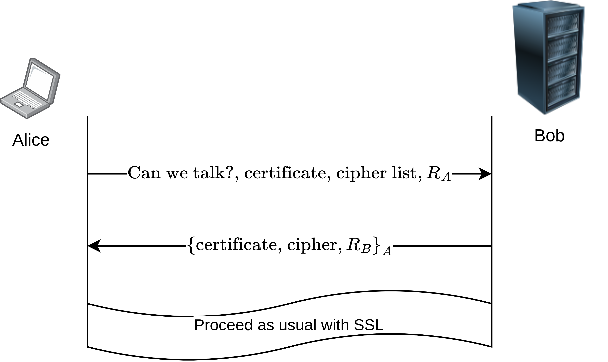

# 1
Consider 3 subjects $s_1$, $s_2$ and $s_3$. Consider 3 objects $o_1$, $o_2$ and $o_3$.
Consider rights $r$, $w$ and $c$.
Draw an access control matrix and add some rights(s) in each cell. (Leave 2 cells empty.)

## Answer
\begin{centering}
\begin{tabular}{|c|ccc|}
  \hline
   \text{ACM} & $o_1$ & $o_2$& $o_3$\\
  \hline
  $s_1$ & $r$ & $w$ & $c$\\
  $s_2$ & $w$ &     & $rw$\\
  $s_3$ & $c$ & $rc$ &     \\
  \hline
\end{tabular}
\end{centering}

# 2
Give the ACL and C-List representations of your matrix above.

## Answer
### ACL
- $o_1$: $\left[s_1: \{r\}, s_2: \{w\},  s_3: \{c\} \right]$
- $o_2$: $\left[s_1: \{w\}, s_2: \{\},   s_3: \{rc\} \right]$
- $o_3$: $\left[s_1: \{c\}, s_2: \{rw\}, s_3: \{\} \right]$

### Capability List
- $s_1$: $\left[o_1: \{r\}, o_2: \{w\},  o_3: \{c\} \right]$
- $s_2$: $\left[o_1: \{w\}, o_2: \{\},   o_3: \{rw\} \right]$
- $s_3$: $\left[o_1: \{c\}, o_2: \{rc\}, o_3: \{\} \right]$

# 3
Consider a system with IPSec.
Suppose two applications A and B in one computer.
A implements SSL to communicate with a remote application C while B does not use SSL to communicate with a remote application D.
Assume C and D execute in the same remote computer.
Compare the communications between A and C, and B and D from a security perspective.
Is there any advantage to using SSL?
What specific attack(s) is(are) one communication prone to that the other is not?

## Answer
We assume that "a system with IPSec" implies that IPSec is *used* by the remote and local computers, but not that any specific configuration is applied.
We also assume that "SSL" is a secure implementation of SSL/TLS 1.3, using a well-managed certificate store.

IPSec is an enormously complex system, and merely having IPSec enabled does not imply any amount of security or integrity of the communications.
For example, if IKE is using a symmetric key of "0x0000000000000000000000000000000000000000000000000000000000000000" (the 256-bit string consisting of all zeros), then a brute-force search may easily find the symmetric key.
Or if a secure configuration of IKE is used, AH is disabled, and ESP is configured without encryption, then all messages are exchanged in plaintext.

In general though, we can say that for the application using SSL/TLS 1.3, A has authenticated C and communication between A and C has confidentiality and integrity.
We cannot in general say anything about the confidentiality, integrity, or authentication of communications using IPSec, as there are many configurations providing few or none of those properties.

# 4
Design a certificate-based mutual authentication version of SSL.

## Answer
A simple way to add mutual authentication to SSL/TLS is to modify the first message to include a client certificate.

Suppose Alice & Bob each have certificates & access to a high-quality PKI.
Then, a mASSL (mutually Authenticated Secure Socket Layer) handshake can be done as in figure 1.

Standard SSL/TLS provides authentication of Bob to Alice.
mASSL provides authentication of Alice to Bob, as only Alice is able to decrypt Bob's message and extract $R_B$, and so continue the rest of the SSL handshake.

Because mASSL is built on top of SSL/TLS, it should inherit all of the security properties of SSL.
However, SSL/TLS is a non-trivial protocol, and so formal security analysis is required before any security is claimed.

# 5
Develop an inter-realm version of the Kerberos protocol where Alice in realm 1 is able to communicate with Bob in realm 2.
You only need to show how realm 1 KDC where Alice belongs facilitates this process with Alice and realm 2 KDC where Bob belongs.
State your assumptions and briefly explain your protocol.

## Answer
We assume that the KDCs have access to a well-managed PKI.

Our protocol is called Inter-Realm Kerberos Over mASSL (IRKOM).

In IRKOM, Alice asks her KDC $KDC_A$ (using her TGT) to help setup a connection to Bob using Bob's KDC $KDC_B$.
$KDC_A$ will establish a mutually-authenticated connection to $KDC_B$ using mASSL.

$KDC_A$ will then carry out a 'normal' Kerberos ticket request for a ticket $T_B$ for Alice to talk to Bob from $KDC_B$.
$KDC_B$ has authenticated $KDC_A$, and so grants $T_B$.
$KDC_A$ can send $T_B$ to Alice, who can use it to talk to Bob as in 'normal' Kerberos.

IRKOM achieves authentication of Alice to $KDC_A$ the same way as 'normal' Kerberos.
IRKOM achieves authentication of $KDC_A$ to $KDC_B$ through mASSL.
IRKOM achieves authentication of Alice to Bob the same way as 'normal' Kerberos.

As with mASSL (whose security is not certain), Kerberos is a complicated protocol.
This means that (like mASSL), full security proofs are required before IRKOM is considered secure.

# 6
BLP meets Access Control Matrix (ACM):
We design a new authorization model that combines MAC (BLP) and DAC (ACM).
Obviously, there could be some conflict in the permissions between the two models.
For example, BLP may disallow access but ACM may allow.

We resolve this as follows:
BLP’s decision always takes precedence over that of ACM in the case BLP disallows access to an object (read or write as the case may be).
This respects the “mandatory” access control spirit of BLP.
In other cases, a subject is allowed to access an object only if it is allowed both by BLP and ACM.

Let:

- $ACL(o_1): (s_1,rw), (s_2,r), (s_3,r)$
- $ACL(o_2): (s_2,r), (s_3,w)$
- $ACL(o_3): (s_1,r), (s_2,r), (s_3,w)$
- $ACL(o_4): (s_1,w), (s_3,r)$
- $ACL(o_5): (s_2,r)$

Let $CLR(s_1)=TS$, $CLR(s_2)=S$, $CLR(s_3)=C$, $CLS(o_1)=TS$, $CLS(o_2)=S$, $CLS(o_3)=C$, $CLS(o_4)=TS$ and $CLS(o_5)=TS$.

Answer the following:

0. Can $s_1$ write to $o_2$?
1. Can $s_2$ read $o_3$?
2. Can $s_1$ read $o_2$?
3. Can $s_1$ read $o_4$?
4. If $s_1$ creates a new object $o_6$ where $CLS(o_6)=S$ and sets $ACL(o_6): (s_1,rw), (s_2,w), (s_3,rw)$, can $s_1$ read $o_6$?

## Answer
We assume here that BLP is the Bell-LaPadula MAC system.

0. No. The $*$-Property of BLP disallows this.
1. Yes. The SS-Property of BLP allows this, as does the ACL of $o_3$.
2. No. The SS-Property of BLP allows this, but the ACL of $o_2$ does not.
3. No. The SS-Property of BLP allows this, but the ACL of $o_4$ does not.
4. $s_1$ should be prevented (by the $*$-Property of BLP) from creating an object with classification $S$. If such an object existed, the SS-Property of BLP would allow access, as would the ACL of $o_6$.
